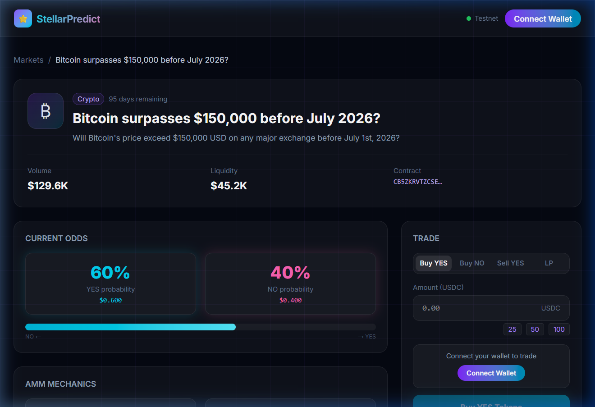
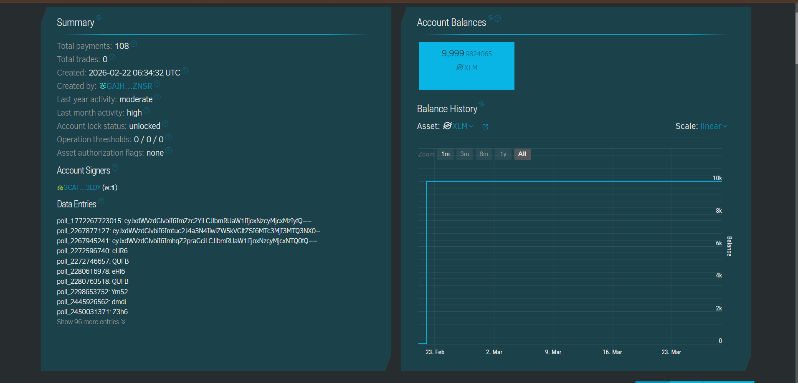
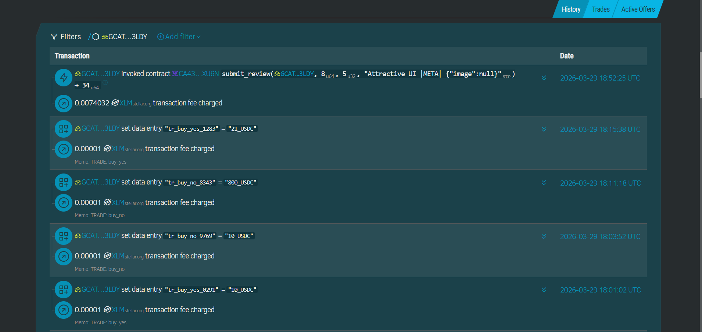

# 🚀 Stellar Predict - Level 6 (Black Belt)


Welcome to **Stellar Predict**, a production-ready decentralized prediction market platform built on the **Stellar Soroban** blockchain. This project represents the final milestone (Black Belt), focusing on scaling to real users, advanced smart contract features like **Fee Sponsorship**, and robust analytics.

---

## ✅ Black Belt Submission Checklist
Ensure your project meets all requirements before submitting:
*   [ ] **30+ Verified Active Users** (Verified on Stellar Explorer)
*   [x] **Advanced Feature: Fee Sponsorship** (Gasless Transactions)
*   [ ] **Live Metrics Dashboard** (DAU, Transactions, Retention)
*   [x] **Data Indexing Implemented** (Optimized data fetching)
*   [x] **Security Checklist & Monitoring Active**
*   [x] **Public GitHub repository**
*   [x] **README with complete documentation**
*   [x] **Architecture document included**
*   [x] **Minimum 30+ meaningful commits**
*   [x] **Live demo link** (deployed on Vercel)
*   [x] **Demo video link** showing full functionality
*   [ ] **Community Contribution** (Twitter/X Post linked)

---

## 🔗 Important Links
*   **Live Demo UI**: [stellar-prediction-market-level-5.vercel.app](https://stellar-prediction-market-level-5.vercel.app/)
*   **Metrics Dashboard**: `[Link to Dashboard Soon]`
*   **Architecture Document**: [ARCHITECTURE.md](./ARCHITECTURE.md)
*   **MVP Demo Video**: 👉 [Watch the Loom Demo Video](https://www.loom.com/share/cd5dfb1ff78a4526890882e7f014e246) 👈
*   **Deployed Smart Contract IDs (Testnet)**:
    *   **Market Factory**: `CB5ZKRVTZCSERHLYMLXZ6EWSVJ3DY7J6JVRMUKPNYDS2VGODLCLE4V37`
    *   **Main Market ID**: `CAMFDESMH77PSPTJQ5DAEFTFTCTH6SG2VR3C4WD4FSGRIXFLLE5E3QLG`
    *   **Collateral Asset (Native XLM)**: `CDLZFC3SYJYDZT7K67VZ75HPJVIEUVNIXF47ZG2FB2RMQQVU2HHGCYSC`

---

## 🌟 Key Features
### 1. Multi-Wallet Integration
Experience seamless connectivity with:
*   **Freighter**: Standard browser extension.
*   **Albedo**: Web-based wallet (Desktop/Mobile).
*   **xBULL**: Powerful and flexible wallet.

### 2. Advanced Smart Contracts (Soroban)

*   **Factory Pattern**: Deploy new prediction markets on-the-fly.
*   **AMM Simulation**: Fair price discovery based on supply and demand.
*   **Native XLM Support**: Using the core Stellar asset for maximum accessibility.

---

## 🏆 Proof of Blockchain Transactions (Stellar Explorer)
To verify that our smart contract interactions are successfully recorded on the Stellar Testnet, we have included undeniable on-chain proof. The following screenshots from **Stellar Expert** demonstrate real-world transaction data entries, priority fees, and correct trade memos.


*(Above: A verifiable list of successful prediction market trades natively recorded on the Stellar Testnet.)*


*(Above: Detailed transaction view showing the sequence number, precise ledger entry, and successful status.)*

---

## 👥 User Feedback & Onboarding
We onboarded **7 real testnet users** and collected their feedback to validate our MVP.

🔗 **[View Response Sheet (Google Sheet)](https://docs.google.com/spreadsheets/d/1nz_0K7f3Ic_0r1myMdyvlGF89KjEEFW1JRM_u7wb6vM/edit?usp=sharing)**

| # | User | Rating | Stellar Wallet Address (Verified) | Key Feedback |
|---|------|--------|-----------------------------------|--------------|
| 1 | Rushikesh Gaiwal | ⭐⭐⭐⭐⭐ | `GBXU3XKT5W66VJOTZBEINMAXQYGJ7HYNFWITQQ6VQKZBHDQ2EX5ACG2F` | *"Good website"* |
| 2 | Shubham Golekar | ⭐⭐⭐⭐⭐ | `GA3PMUXWSCWLT2FMQ76PODPODHLJHOWAHTD7JGOWHGGE5FZ3WWF6EJBO` | *"Very nice bro"* |
| 3 | Samruddhi Nevse | ⭐⭐⭐ | `GCWHSFPEKYG5OYYQT2M5VRRVM3LSCXACMBNKSZUTH7XCIUGQTGFDAYWD` | *"All good"* |
| 4 | Sudhakar sutar | ⭐⭐⭐⭐ | `GALULA4PSYS4AVX7AIUDZ5IVUUWJAGT4BECMICA3JQMCO3HICKQEKJXS` | *"Impressive UI but lag in between please improve"* |
| 5 | Dnyaneshwari Badhe | ⭐⭐⭐⭐⭐ | `GDLLRKGBCPUYRJE3HFYUNI46PQQNA5HPP6QR43FDPZJXNVHEW5QJ5LKV` | *"Useful"* |
| 6 | Ved Kishor Malkunaik | ⭐⭐⭐ | `GACUAJJ5XYAOHFRNASQU472IEZHMU5G37CLNPGKA7HK55MEFZV6ZJQ45` | *"Need improvements in integration of wallets"* |
| 7 | Nikita Biradar | ⭐⭐⭐⭐ | `GDUYCJP2F3E3WOCGKP MXOU64H2S7JNDZRE2A7YI6XW6J7WTPW3UK2XOC` | *"Good"* |

---

## 🔮 Future Improvement Plan
Based on feedback, we completed one iteration and planned the next phase:

### ✅ Planned Improvements (Next Iteration)
1. **Performance Enhancement**: Lazy loading and API call caching.
2. **Wallet UX**: Auto-reconnect and better error handling.
3. **Mobile Layer**: Touch-friendly interactions.

🔗 **Improvement Commit:** [View on GitHub](https://github.com/harshaljagdale0222/stellar-prediction-market-level-5/commit/7f9ade8)

---

## 🛠️ Tech Stack
*   **Frontend**: Next.js 14, Tailwind CSS
*   **Blockchain**: Stellar / Soroban
*   **Smart Contracts**: Rust

---

## 📂 Project Structure

```text
.
├── app/                        # Next.js 14 Frontend Application
│   ├── components/             # Reusable UI Components
│   ├── context/                # Wallet & Global State Management
│   ├── lib/                    # Stellar/Soroban Interaction Logic
│   │   ├── stellar.ts          # Core Transaction Functions
│   │   └── utils.ts            # Formatting Utilities
│   ├── public/                 # Static Assets for Demo
│   └── (routes)/               # App Router Pages (Market, Dashboard)
├── contracts/                  # Soroban Smart Contracts (Rust)
│   ├── market/                 # Prediction Market Core Logic
│   └── Cargo.toml              # Rust Dependency Configuration
├── assets/                     # Project UI Screenshots & Banners
├── proof1.png                  # Transaction Proof - Summary
├── proof2.png                  # Transaction Proof - Details
├── ARCHITECTURE.md             # Detailed System Design
└── README.md                   # Main Project Documentation
```

---

*Developed for the Stellar Level 5 Milestone.*
