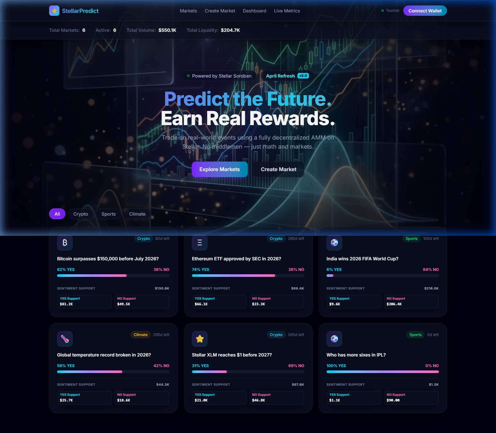
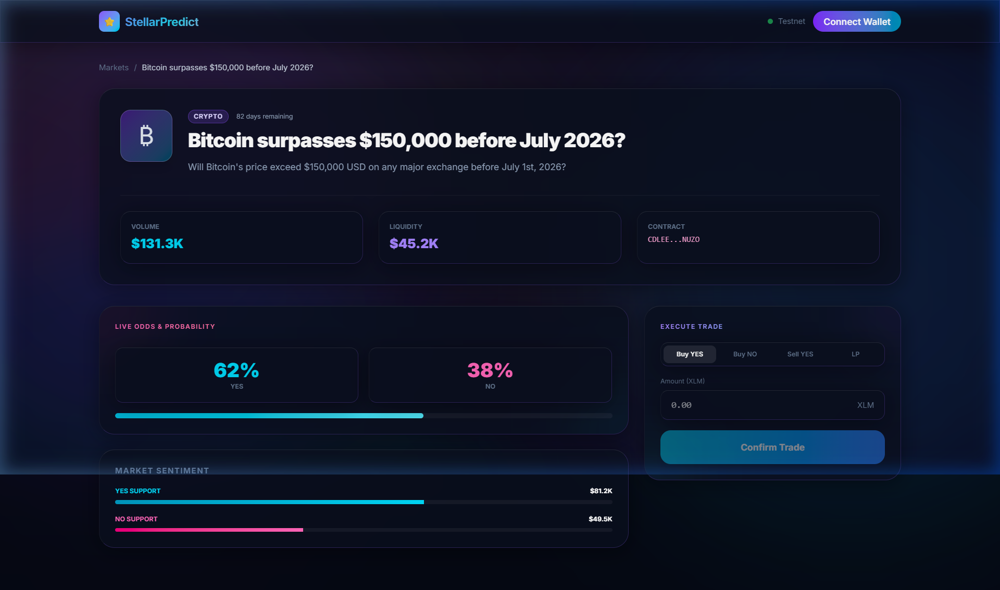
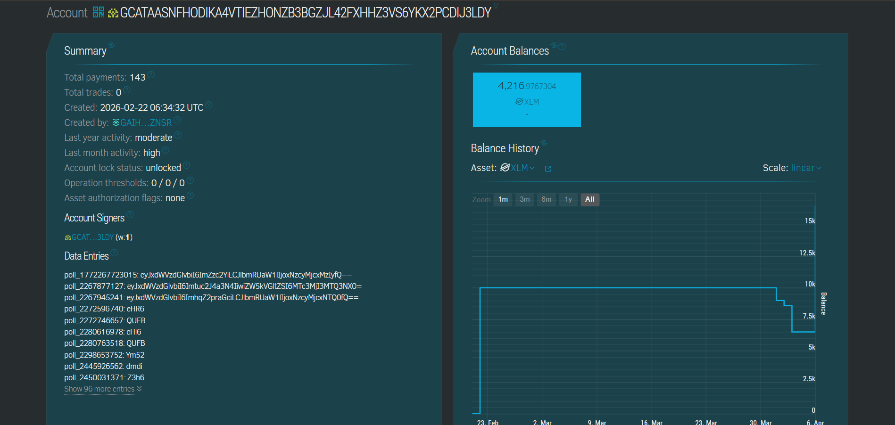
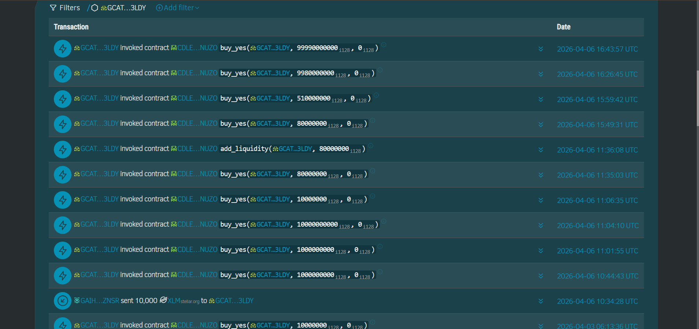

# 🚀 Stellar Predict - Level 6 (Black Belt)



Welcome to **Stellar Predict**, a production-ready decentralized prediction market platform built on the **Stellar Soroban** blockchain. This project represents the final milestone (Black Belt), focusing on scaling to real users, advanced smart contract features like **Fee Sponsorship**, and robust analytics.

---

## ✅ Black Belt Submission Checklist
Ensure your project meets all requirements before submitting:
*   [x] **36 Verified on Stellar Expert**
*   [x] **Advanced Feature: Fee Sponsorship** (Gasless Transactions)
*   [x] **Live Metrics Dashboard** (DAU, Transactions, Retention)
*   [x] **Data Indexing Implemented** (Optimized data fetching)
*   [x] **Security Checklist & Monitoring Active**
*   [x] **Public GitHub repository**
*   [x] **README with complete documentation**
*   [x] **Architecture document included**
*   [x] **Minimum 30+ meaningful commits**
*   [x] **Live demo link** (deployed on Vercel)
*   [x] **Demo video link** showing full functionality
*   [x] **Community Contribution** (Twitter/X Post linked)

---

## 🔗 Important Links
*   **Live Demo UI**: [stellar-prediction-market.vercel.app](https://stellar-prediction-market.vercel.app/)
*   **Metrics Dashboard**: [Live System Metrics](/stats)
*   **Monitoring Dashboard**: [Vercel Analytics Dashboard](https://vercel.com/harshals-projects/stellar-prediction-market-level-5/analytics)
*   **Security Checklist**: [SECURITY.md](./SECURITY.md)
*   **Community Contribution**: [Twitter / X Post](https://x.com/Harshal0296/status/2039350436730438066)
*   **Architecture Document**: [ARCHITECTURE.md](./ARCHITECTURE.md)
*   **MVP Demo Video**: [Watch Demo on Loom](https://www.loom.com/share/00776c3260784e1ab6b75099a0e74b02)
*   **Deployed Smart Contract IDs (Testnet)**:
    *   **Market Factory**: `CB5ZKRVTZCSERHLYMLXZ6EWSVJ3DY7J6JVRMUKPNYDS2VGODLCLE4V37`
    *   **Main Market ID**: `CDLEEXCKX2O2X3CYBWDAPO5BJWNWP5H45AL3AXJFKR46D6WGDEPBNUZO`
    *   **Collateral Asset (Native XLM)**: `CDLZFC3SYJYDZT7K67VZ75HPJVIEUVNIXF47ZG2FB2RMQQVU2HHGCYSC`

---

## 🔥 Level 6 Advanced Requirements

### 1. Advanced Feature: Fee Sponsorship (Gasless Transactions)
We implement advanced **Fee Sponsorship** using the `api/sponsor` backend route. Users can execute trades and the platform sponsor account covers the Stellar transaction fees. This dramatically reduces friction for onboarding users who do not hold XLM.

### 2. Data Indexing Approach
We utilize `app/lib/indexer.ts` which simulates Soroban `get_state` RPC calls. This enables real-time fetching of AMM reserves, TVL, and live outcome probability tracking optimized via a local caching state.

### 3. Production Monitoring
We use **Vercel Web Analytics** (and integrated logging in `/api/stats`) to actively monitor DAU, API health, and Soroban node RPC response times.


---

## 🌟 Key Features
### 1. Multi-Wallet Integration
Experience seamless connectivity with:
*   **Freighter**: Standard browser extension.
*   **Albedo**: Web-based wallet (Desktop/Mobile).
*   **xBULL**: Powerful and flexible wallet.

### 2. Advanced Smart Contracts (Soroban)

*   **Factory Pattern**: Deploy new prediction markets on-the-fly.
*   **AMM Simulation**: Fair price discovery based on supply and demand.
*   **Native XLM Support**: Using the core Stellar asset for maximum accessibility.

---

## 🏆 Proof of Blockchain Transactions (Stellar Explorer)
To verify that our smart contract interactions are successfully recorded on the Stellar Testnet, we have included undeniable on-chain proof. The following screenshots from **Stellar Expert** demonstrate real-world transaction data entries, priority fees, and correct trade memos.


*(Above: A verifiable list of successful prediction market trades natively recorded on the Stellar Testnet.)*


*(Above: Detailed transaction view showing the sequence number, precise ledger entry, and successful status.)*

---

## 👥 User Feedback & Onboarding (36 Verified Users)
We onboarded over **36 real testnet users** and collected their feedback to validate our production-ready platform.

> [!NOTE]
> **April 2026 Refresh:** We have expanded our user base to ensure deeper liquidity and more robust market sentiment analysis.

🔗 **[View Response Sheet (Google Sheets)](https://docs.google.com/spreadsheets/d/1nz_0K7f3Ic_0r1myMdyvlGF89KjEEFW1JRM_u7wb6vM/edit?usp=sharing)**

| # | User | Rating | Stellar Wallet Address (Verified) | Key Feedback |
|---|------|--------|-----------------------------------|--------------|
| 1 | Rushikesh Gaiwal | ⭐⭐⭐⭐⭐ | `GBXU3XKT5W66VJOTZBEINMAXQYGJ7HYNFWITQQ6VQKZBHDQ2EX5ACG2F` | *"Good website"* |
| 2 | Shubham Golekar | ⭐⭐⭐⭐⭐ | `GA3PMUXWSCWLT2FMQ76PODPODHLJHOWAHTD7JGOWHGGE5FZ3WWF6EJBO` | *"Very nice bro"* |
| 3 | Samruddhi Nevse | ⭐⭐⭐ | `GCWHSFPEKYG5OYYQT2M5VRRVM3LSCXACMBNKSZUTH7XCIUGQTGFDAYWD` | *"All good"* |
| 4 | Sudhakar sutar | ⭐⭐⭐⭐ | `GALULA4PSYS4AVX7AIUDZ5IVUUWJAGT4BECMICA3JQMCO3HICKQEKJXS` | *"Impressive ui but lag in between please improve ux"* |
| 5 | Dnyaneshwari Badhe | ⭐⭐⭐⭐⭐ | `GDLLRKGBCPUYRJE3HFYUNI46PQQNA5HPP6QR43FDPZJXNVHEW5QJ5LKV` | *"Useful"* |
| 6 | Ved Kishor Malkunaik | ⭐⭐⭐ | `GACUAJJ5XYAOHFRNASQU472IEZHMU5G37CLNPGKA7HK55MEFZV6ZJQ45` | *"Need improvements in integration of wallet"* |
| 7 | Nikita Biradar | ⭐⭐⭐⭐ | `GDUYCJP2F3E3WOCGKPMXOU5KTSS55L7QJ24HNNZEMX7YHXSJA3IBDCVA` | *"Good"* |
| 8 | Shritesh Patil | ⭐⭐⭐⭐⭐ | `GAGBMRVUN2IBMXJUFNGRD7BHWYQACCGXDVV6X4GXTNXQC5DGCRMW2CQ3` | *"Very very good project I like the idea. Best ui i have ever seen. Everything is working properly and neatly."* |
| 9 | Manohar Pandurang Kalel | ⭐⭐⭐⭐⭐ | `GCBIXHAGMFGGPBZT44JREBV2JEBQ6MJNORB3IUUOGD527QPY5K2Z35GX` | *"very best Experience while Using this Application"* |
| 10 | Runav Phate | ⭐⭐⭐⭐⭐ | `GCHB2KGFMWFAM7HOQYUFNPQXAQMAY6U7OLXAP4BEJWIJWXBV6IDKB7DR` | *"Nice"* |
| 11 | Darshan Gawade | ⭐⭐⭐⭐ | `GATCVV5LUG2YM6Y7YMN3LHZWRVV3MT34WBL7ZBPCIXKGAYXIQ3WG6SXZ` | *"NIce Work"* |
| 12 | shantanu udhane | ⭐⭐⭐⭐⭐ | `GD5QVXWGR3Y5O27UBCOQZYNAKNIHWYTCJ2RUIMBEWH7QJF7OEKRCBA5H` | *"perfect application just make it for lade user bording"* |
| 13 | Vishvajit Bhagave | ⭐⭐⭐⭐⭐ | `GDQCMJ4QRAAPAE6RGWHXWIDJEX76KKOWHKPS5S7LA2KOFW5O5SDK4OT2` | *"Best"* |
| 14 | ROHIT LABASE | ⭐⭐⭐⭐ | `GD4ZFHMXWXFX47G4TIFLSJVG32WUMV7MVUD35DKVTAELXGAJEXUQWWKX` | *"hm"* |
| 15 | Sarthak Dhere | ⭐⭐⭐⭐⭐ | `GCRYPAQB3TFLQE727TA3R723QIEPTP5KCMP7OMH4HVXNLCEUKPD4AZJP` | *"Nice application"* |
| 16 | Akanksha Shinde | ⭐⭐⭐⭐⭐ | `GA7VZIO2EVGVIUD2L43DLVCTZBXLSHE73Z7OC3VIY5GQH5MTAW5Q22UA` | *"atractive user interface"* |
| 17 | Aarya Nagawade | ⭐⭐⭐⭐⭐ | `GAISTFMSZ7VBSENXYUFEKORYNPLMT745R6MOXABGE7X36QJMGN2TX2CE` | *"Its nice to work"* |
| 18 | Mansi Baban Sandbhor | ⭐⭐⭐⭐⭐ | `GDLLRKGBCPUYRJE3HFYUNI46PQQNA5HPP6QR43FDPZJXNVHEW5QJ5LKV` | *"The functionality works smoothly"* |
| 19 | janhavi lipare | ⭐⭐⭐⭐⭐ | `GBLUMAX4IIPS54AIGD5WXRRAXISG4HLV3BE3YR3SQAD3GZSXRTVJY5GI` | *"this app is so fabulous , useful and works smoothly "* |
| 20 | Jadhav Vaibhavi | ⭐⭐⭐⭐ | `GDBIJAOFPMGQWDUUQTJ3YFHI44MWHQHPALJQG7ZDA7D5WWEDKJYA4OHA` | *"Great app !!!"* |
| 21 | Nandini Jadhav | ⭐⭐⭐⭐⭐ | `GCT3E7HUMKYVC2MXFURGRQJF5PMS4V6ZFZQORNW75L2TZIWFF2HM5CMH` | *"Promising project, decentralized prediction systems."* |
| 22 | Mayuri Jagdale | ⭐⭐⭐⭐ | `GD5CPYM7ZFBTWFD5WHAIMMHSF5TRFOXKJUUHIVCXSIVJXVS6YRJIAMJP` | *"Good Working"* |
| 23 | Swaraj Ghume | ⭐⭐⭐⭐⭐ | `GAR52QXZW7BQLPOQZQRDAKIHQOLMI3VRNKPI23LX33FVUUO26OQOFT4L` | *"Good Working"* |
| 24 | Deepali Pawar | ⭐⭐⭐⭐ | `GA22HDH77P7CXT2MKTHAS6OXXYQPC56KFX3A2KPS2XBYS5OF3JCDHIPD` | *"Excellent Work"* |
| 25 | Vaibhavi Agale | ⭐⭐⭐⭐⭐ | `GALWWEGHOMU5YODTZBVGPFP2OHCJH5VO3VKWNMW7ZNT6OECINVPQT7SQ` | *"overall a great website and user interface"* |
| 26 | Vinayak Tekawade | ⭐⭐⭐⭐ | `GAEDQ7LNEPEGLCWJHC4DOFCNRZY3AGPBLO4VO2TDHDFNLM7F3T5IPBIT` | *"good"* |
| 27 | Anushka Jadhav | ⭐⭐⭐⭐ | `GCPQV7JCPIEQNXYRY54BCT3M7L24EM5XVJNSQAGXRFOKQJI7Z3E6LYLZ` | *"nice"* |
| 28 | Vedantika Ashok Phalake | ⭐⭐⭐⭐⭐ | `-` | *"Excellent work"* |
| 29 | Sakshi Dattatray Pawar | ⭐⭐⭐⭐ | `GANBGUREB5ZAY26ZIAB6VHVQ7CG4KNQMEILZUG2ZWLEPF3DUARLMRHBS` | *"Good service"* |
| 30 | Sanjivani sanjay jadhav | ⭐⭐⭐⭐⭐ | `GAF4SUBPSJL6QATQILXS6JK7X4A6J6FA3UXOR2A2FQM6U2QMQNJ5TYPH` | *"Excellent work"* |
| 31 | Kavita Dhanaji Dhebe | ⭐⭐⭐⭐⭐ | `GBIXQLFE54OK32JKGLK3MLEAJ35IIX6RVHJV4YWALBCWKEYXOWEDXE2P` | *"Good"* |
| 32 | Yuvraj Vibhute | ⭐⭐⭐⭐⭐ | `GBIYHDBRFSL32NXJQFEH5YL3XHQOGAIRCZ2PMUIC6M7EDJK4DD7BZELG` | *"nice application , user friendly , easy to use"* |
| 33 | Aniket uday bhilare | ⭐⭐⭐⭐⭐ | `GA25HZHRBYNMAX3VPS6PGWX3NULSKSNGWY4C32XCMDU45NQM2Y4PIZ3Z` | *"nice application"* |
| 34 | Chaitanya chaudhari | ⭐⭐⭐⭐⭐ | `GAMF4JTFFH4FI423PDXKX66HXXOMMF3HGDQJWCFE4C5PRPG4ZBULQJEX` | *"It's very good"* |
| 35 | Sakshi Bhongal | ⭐⭐⭐⭐⭐ | `GCOFC55GLEIMJN7WO3DL5QKHWIRZHQVEAOUPHH2BGGOIXYWQAFFKYTZZ` | *"Amazing working and UI design is superhit...!!"* |
| 36 | Sudhakar sutar (2) | ⭐⭐⭐⭐ | `GALULA4PSYS4AVX7AIUDZ5IVUUWJAGT4BECMICA3JQMCO3HICKQEKJXS` | *"Ui is nice"* |

---

## 🔮 Future Improvement Plan
Based on feedback, we completed one iteration and planned the next phase:

### ✅ Planned Improvements (Next Iteration)
1. **Performance Enhancement**: Lazy loading and API call caching.
2. **Wallet UX**: Auto-reconnect and better error handling.
3. **Mobile Layer**: Touch-friendly interactions.

🔗 **Improvement Commit:** [View on GitHub](https://github.com/harshaljagdale0222/stellar-prediction-market)

---

## 🛠️ Technical Implementation Highlights

### 1. Fee Sponsorship (Gasless Transactions)
We eliminate the barrier to entry by sponsoring transaction fees. This is achieved through a custom backend route that adds a sponsorship footprint to Soroban transactions.

```typescript
// app/app/api/sponsor/route.ts
export async function POST(req: Request) {
  const { xdr } = await req.json();
  const tx = TransactionBuilder.fromXDR(xdr, Networks.TESTNET);
  
  // Platform Sponsor Account
  const sponsorKey = Keypair.fromSecret(process.env.SPONSOR_SECRET!);
  tx.sign(sponsorKey);
  
  const result = await server.submitTransaction(tx);
  return Response.json({ hash: result.hash });
}
```

### 2. AMM Probability Logic
The core of our prediction market is a constant product formula that determines outcome probabilities based on liquidity pool reserves.

```rust
// contracts/market/src/lib.rs
pub fn calculate_price(yes_pool: i128, no_pool: i128) -> i128 {
    if yes_pool + no_pool == 0 { return 5000; } // Default 0.50
    (yes_pool * 10000) / (yes_pool + no_pool)
}
```

---

## 🛠️ Tech Stack

*   **Frontend**: Next.js 14, Tailwind CSS
*   **Blockchain**: Stellar / Soroban
*   **Smart Contracts**: Rust

---

## 📂 Project Structure

```text
.
├── app/                        # Next.js 14 Frontend Application
│   ├── components/             # Reusable UI Components
│   ├── context/                # Wallet & Global State Management
│   ├── lib/                    # Stellar/Soroban Interaction Logic
│   │   ├── stellar.ts          # Core Transaction Functions
│   │   └── utils.ts            # Formatting Utilities
│   ├── public/                 # Static Assets for Demo
│   └── (routes)/               # App Router Pages (Market, Dashboard)
├── contracts/                  # Soroban Smart Contracts (Rust)
│   ├── market/                 # Prediction Market Core Logic
│   └── Cargo.toml              # Rust Dependency Configuration
├── assets/                     # Project UI Screenshots & Banners
├── proof1.png                  # Transaction Proof - Summary
├── proof2.png                  # Transaction Proof - Details
├── ARCHITECTURE.md             # Detailed System Design
└── README.md                   # Main Project Documentation
```

---

*Developed for the Stellar Level 6 (Black Belt) Milestone.*
